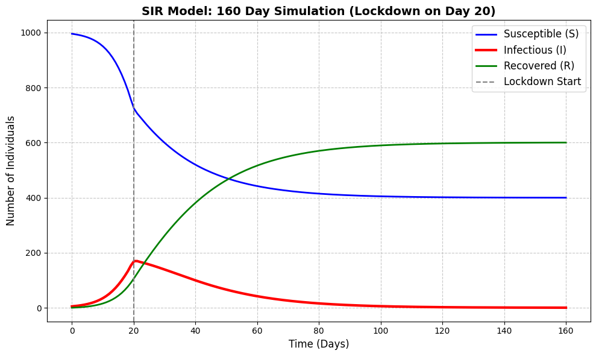

# Mathematical Modeling of Dynamic Systems: Pharmacokinetics & Mechanical Damping

This repository contains the computational implementations for my Mathematics III (MATH F211) assignment. The project focuses on bridging the gap between theoretical calculus and practical engineering applications through Python-based simulations.

---

## Part 1: Systems of Linear Differential Equations (Pharmacokinetics)
This project models drug absorption in a two-compartment system (stomach and bloodstream). It uses a system of first-order linear differential equations to track how a medication is absorbed and then eliminated from the body, helping to predict the time of peak concentration to avoid toxicity.

*Figure 1: The graph perfectly visualizes the formulas. The blue line (stomach) starts at 100 mg and smoothly decays toward zero. The red line (bloodstream) starts at 0, rises as the drug is absorbed, peaks, and then slowly decays as the body eliminates the medicine.*

---

## Part 2: Laplace Transforms (Car Suspension)
This project models the vertical displacement of a vehicle chassis subjected to an instantaneous impulse force (a speed bump). By utilizing Laplace Transforms, the differential equation governing the mass-spring-damper system is solved to derive the displacement equation that demonstrated underdamped harmonic oscillation.

*Figure 2: The resulting graph illustrates an underdamped harmonic oscillation which showing a sharp spike from the speed bump, followed by a few smooth, shrinking bounces as the car returns to a flat equilibrium.*

---

## Additional Work: SIR Epidemiological Model
This is an additional simulation modeling the spread of a virus through a population. It uses a modified SIR (Susceptible-Infectious-Recovered) framework and includes a dynamic "lockdown" intervention that alters the transmission rate mid-simulation, demonstrating how public health policies mathematically flatten the infection curve.

*Figure 3: SIR model showing the impact of a mid-simulation lockdown on infection spread.*
